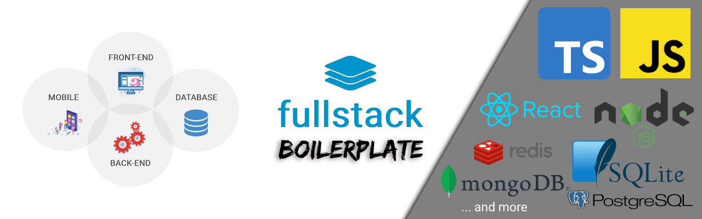
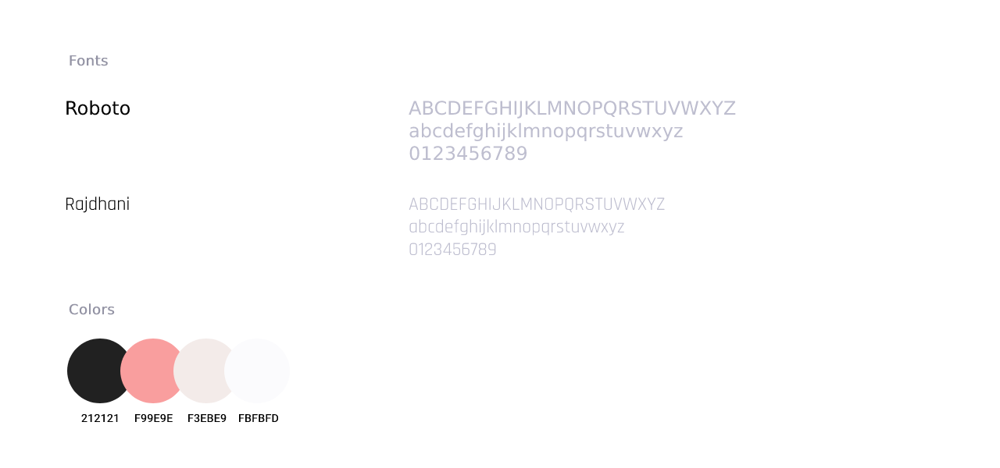
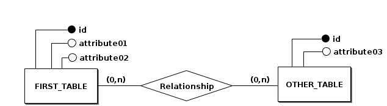
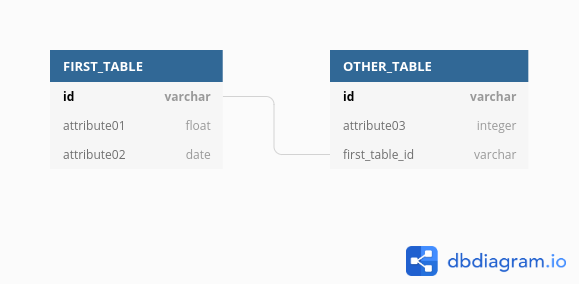

<div align='justify'>



![BADGE_NODE_VERSION]
![BADGE_NPM_VERSION]
![BADGE_LICENSE]
![BADGE_ISSUES_OPEN]
![BADGE_ISSUES_CLOSED]
![BADGE_OPEN_PULL_REQUESTS]
![BADGE_STARS]
![BADGE_FORKS]

> Projeto desenvolvido utilizando Next.js, Node e TypeScript de um calendário de eventos.

<br>

- 🌎 Production: https://website.com
- 🌐 Development: https://x0n4d0.github.io/caleventos
- 🔗 API: https://api.website.com
- 📲 Mobile: https://play.google.com/store/apps/details?id=caleventos

<br>

---

### **Índice**


- 📄 **[Sobre o Projeto](#-sobre-o-projeto)**
- 🎦 **[Preview](#-preview)**
- 🎨 **[UI Design](#-ui-design)**
- 🗄️ **[Modelo dos Dados](#%EF%B8%8F-modelo-dos-dados)**
- 📝 **[Requisitos](#-requisitos)**
- 📦 **[Releases](#-releases)**
- 💻 **[Tecnologias](#-tecnologias)**
- ⚒️ **[Ferramentas](#%EF%B8%8F-ferramentas)**
- ⚙️ **[Dependências](#%EF%B8%8F-dependências)**
- 🍷 **[Utilizando o Projeto](#-utilizando-o-projeto)**
- 🌱 **[Contribuindo](#-contribuindo)**
- 💡 **[Autor](#-autor)**
- 🧾 **[Licença](#-licença)**

---

<br>

<!------------------------------->

## 📄 **Sobre o Projeto**

Type here about your project and what problem it solves...

<kbd>[⬆️ Índice](#índice)</kbd>

<br>

<!------------------------------->

## 🎦 **Preview**


<kbd>[⬆️ Índice](#índice)</kbd>

<br>

<!------------------------------->

## 🎨 **UI Design**

<kbd>🖼️ [Protótipo do Figma](https://www.figma.com/proto/CxwbDcGOiSFaBC8dJBc5uw/Caleventos?node-id=7%3A0&scaling=min-zoom&page-id=0%3A1)</kbd>



<kbd>[⬆️ Índice](#índice)</kbd>

<br>

<!------------------------------->

## 🗄️ **Modelo dos Dados**

### Conceptual Model


### Logical Model



<kbd>[⬆️ Índice](#índice)</kbd>

<br>


<!------------------------------->

## 📝 **Requisitos**

Read the complete requirements documentation for this project **[here](./docs/requirements)**.

<kbd>[⬆️ Índice](#índice)</kbd>

<br>


<!------------------------------->


## 📦 **Releases**

See **[CHANGELOG](./docs/guides/CHANGELOG.md)** file for read about the releases.

<kbd>[⬆️ Índice](#índice)</kbd>

<br>


<!------------------------------->


## 💻 **Tecnologias**

### Shared

- [TypeScript](https://www.typescriptlang.org/)
- [Husky](https://github.com/typicode/husky)
- [Commitlint](https://github.com/conventional-changelog/commitlint)
- [ESLint](https://eslint.org/)
- [Prettier](https://prettier.io/)
- [Jest](https://jestjs.io/)

### Server

- [NodeJS](https://nodejs.org/en/)
- [TS Node Dev](https://www.npmjs.com/package/ts-node-dev)

### Client

...

### Mobile

...

<kbd>[⬆️ Índice](#índice)</kbd>

<br>


<!------------------------------->


## ⚒️ **Ferramentas**

- [Visual Studio Code](https://code.visualstudio.com/) - Editor
- [Figma](https://www.figma.com/) - UI Design (Protótipo)
- [Undraw](https://undraw.co/) - Download de Imagem
- [Photopea](https://www.photopea.com/) - Desenvolvimento de Artes
- [BR Modelo](http://www.sis4.com/brModelo/) - Modelagem Conceitual dos Dados
- [DB Diagram](https://dbdiagram.io/) - Modelagem Lógica dos Dados

<kbd>[⬆️ Índice](#índice)</kbd>

<br>


<!------------------------------->


## ⚙️ **Dependências**

- [NodeJS](https://nodejs.org/en/) - v14+
- [Git](https://git-scm.com/)
- [Docker](https://www.docker.com/)

<kbd>[⬆️ Índice](#índice)</kbd>

<br>


<!------------------------------->


## 🍷 **Utilizando o Projeto**

After installing all the [dependencies](#%EF%B8%8F-dependencies) on your computer, follow these steps:

```sh
# Clone este repositório:
$ git clone https://github.com/x0n4d0/caleventos

# Abra o diretório raíz pelo terminal:
$ cd caleventos

# Instale as dependências da raíz do projeto:
$ npm ci
```

### Server

 \* See the server [package.json](./packages/server/package.json) file.

```sh
# Abra o diretório do backend (server):
$ cd caleventos/packages/server

# Instale todas as dependências:
$ npm ci

# Rode em modo de desenvolvimento:
$ npm run dev

# Verifique as sintaxe dos arquivos de acordo com o eslint:
$ npm run lint

# Rode os testes unitários:
$ npm run test:unit

# Rode os testes de integração:
$ npm run test:integration

# Rode os testes de staged:
$ npm run test:staged

# Gere os arquivos de coverage:
$ npm run test:ci

# Gere os arquivos de produção:
$ npm run build

# Rode os arquivos de produção:
$ npm start
```


### Client (Web)

...


<kbd>[⬆️ Índice](#índice)</kbd>

<br>


<!------------------------------->


## 🌱 **Contribuindo**

Leia o arquivo **[CONTRIBUTING](./docs/guides/CONTRIBUTING.md)** antes de enviar a sua contribuinção para este projeto.

<kbd>[⬆️ Índice](#índice)</kbd>

<br>


<!------------------------------->

## 💡 **Autor**

<table>
  <tr align=center>
    <th><strong>Maurício Romagnoli</strong></th>
  </tr>
  <tr align=center>
    <td>
      <a href="https://www.linkedin.com/in/mauricioromagnoli/">
        
      </a>
    </td>
  </tr>
</table>

<kbd>[⬆️ Índice](#índice)</kbd>

<br>


<!------------------------------->

## 🧾 **Licença**

**Caleventos** está disponível sobre a livença [MIT](https://opensource.org/licenses/MIT) &#169; Maurício Romagnoli. Veja o arquivo [LICENSE](./LICENSE).

<kbd>[⬆️ Índice](#índice)</kbd>

<br>

</div>


<!------------------------------->


<!-- Badges References -->

[BADGE_NODE_VERSION]: https://img.shields.io/badge/nodejs-v14.16.0-3c873a

[BADGE_NPM_VERSION]: https://img.shields.io/badge/npm-v6.14.11-cc3534

[BADGE_LICENSE]: https://img.shields.io/github/license/x0n4d0/caleventos

[BADGE_ISSUES_OPEN]: https://img.shields.io/github/issues/x0n4d0/caleventos

[BADGE_ISSUES_CLOSED]: https://img.shields.io/github/issues-closed/x0n4d0/caleventos?color=red

[BADGE_OPEN_PULL_REQUESTS]: https://img.shields.io/github/issues-pr/x0n4d0/caleventos?color=blue

[BADGE_STARS]: https://img.shields.io/github/stars/x0n4d0/caleventos?color=inactive

[BADGE_FORKS]: https://img.shields.io/github/forks/x0n4d0/caleventos?color=inactive
