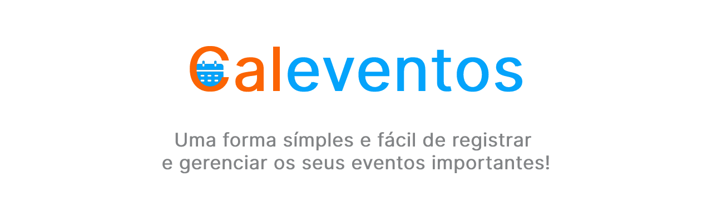
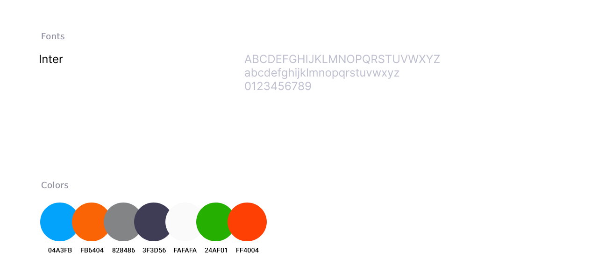
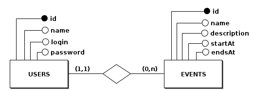

<!--
# Select the string below and replace all occurrences in that document with the name of your project.

fullstack-boilerplate
-->

<div align='justify'>



![BADGE_NODE_VERSION]
![BADGE_NPM_VERSION]
![BADGE_LICENSE]
![BADGE_ISSUES_OPEN]
![BADGE_ISSUES_CLOSED]
![BADGE_OPEN_PULL_REQUESTS]
![BADGE_STARS]
![BADGE_FORKS]

> A template repository to facilitate the creation of complete projects, including server, client, mobile and documentation.

<br>

- 🌎 Production: https://website.com
- 🌐 Development: https://x0n4d0.github.io/fullstack-boilerplate
- 🔗 API: https://api.website.com
- 📲 Mobile: https://play.google.com/store/apps/details?id=fullstack-boilerplate

<br>

---

<!-- <kbd>🇧🇷 [Traduzir PT-BR](./README.pt-br.md)</kbd> -->

### **INDEX**


- 📄 **[About](#-about)**
- 🎦 **[Preview](#-preview)**
- 🎨 **[UI Design](#-ui-design)**
- 🗄️ **[Database Model](#%EF%B8%8F-database-model)**
- 📝 **[Requirements](#-requirements)**
- 📦 **[Releases](#-releases)**
- 💻 **[Techs](#-techs)**
- ⚒️ **[Tools](#%EF%B8%8F-tools)**
- ⚙️ **[Dependencies](#%EF%B8%8F-dependencies)**
- 🍷 **[Using The Project](#-using-the-project)**
- 🌱 **[Contributing](#-contributing)**
- 💡 **[Author](#-author)**
- 🧾 **[License](#-license)**

---

<br>

<!------------------------------->

## 📄 **About**

Type here about your project and what problem it solves...

<kbd>[⬆️ Index](#index)</kbd>

<br>

<!------------------------------->

## 🎦 **Preview**


<kbd>[⬆️ Index](#index)</kbd>

<br>

<!------------------------------->

## 🎨 **UI Design**

<kbd>🖼️ [Figma Prototype](LINK_TO_FIGMA_PROTOTYPE)</kbd>



<kbd>[⬆️ Index](#index)</kbd>

<br>

<!------------------------------->

## 🗄️ **Database Model**

### Conceptual Model


### Logical Model


<kbd>[⬆️ Index](#index)</kbd>

<br>


<!------------------------------->

## 📝 **Requirements**

Read the complete requirements documentation for this project **[here](./docs/requirements)**.

<kbd>[⬆️ Index](#index)</kbd>

<br>


<!------------------------------->


## 📦 **Releases**

See **[CHANGELOG](./docs/guides/CHANGELOG.md)** file for read about the releases.

<kbd>[⬆️ Index](#index)</kbd>

<br>


<!------------------------------->


## 💻 **Techs**

### Shared

- [TypeScript](https://www.typescriptlang.org/)
- [Husky](https://github.com/typicode/husky)
- [Commitlint](https://github.com/conventional-changelog/commitlint)
- [ESLint](https://eslint.org/)
- [Prettier](https://prettier.io/)
- [Jest](https://jestjs.io/)

### Server

- [NodeJS](https://nodejs.org/en/)
- [TS Node Dev](https://www.npmjs.com/package/ts-node-dev)

### Client

...

### Mobile

...

<kbd>[⬆️ Index](#index)</kbd>

<br>


<!------------------------------->


## ⚒️ **Tools**

- [Visual Studio Code](https://code.visualstudio.com/) - Code Editor
- [Figma](https://www.figma.com/) - UI Design (Prototype)
- [Photopea](https://www.photopea.com/) - Art images
- [BR Modelo](http://www.sis4.com/brModelo/) - Database Conceptual Model
- [DB Diagram](https://dbdiagram.io/) - Database Logical Model

<kbd>[⬆️ Index](#index)</kbd>

<br>


<!------------------------------->


## ⚙️ **Dependencies**

- [NodeJS](https://nodejs.org/en/) - v14+
- [Git](https://git-scm.com/)
- [Docker](https://www.docker.com/)

<kbd>[⬆️ Index](#index)</kbd>

<br>


<!------------------------------->


## 🍷 **Using The Project**

After installing all the [dependencies](#%EF%B8%8F-dependencies) on your computer, follow these steps:

```sh
# Clone this repository:
$ git clone https://github.com/x0n4d0/fullstack-boilerplate

# Open the root directory:
$ cd fullstack-boilerplate

# Install the project root dependencies:
$ npm ci
```

### Server

 \* See the server [package.json](./packages/server/package.json) file.

```sh
# Open the server directory:
$ cd fullstack-boilerplate/packages/server

# Install all dependencies:
$ npm ci

# Run server in development mode:
$ npm run dev

# Run eslint to check sintax:
$ npm run lint

# Run unit tests:
$ npm run test:unit

# Run integration tests:
$ npm run test:integration

# Run staged tests:
$ npm run test:staged

# Run coverage files:
$ npm run test:ci

# Generate production files:
$ npm run build

# Run server in production mode:
$ npm start
```


### Client (Web)

...

### Client (Mobile)

...

<kbd>[⬆️ Index](#index)</kbd>

<br>


<!------------------------------->


## 🌱 **Contributing**

See **[CONTRIBUTING](./docs/guides/CONTRIBUTING.md)** guidelines for improve your contribution with this project.

<kbd>[⬆️ Index](#index)</kbd>

<br>


<!------------------------------->

## 💡 **Author**

<table>
  <tr align=center>
    <th><strong>Maurício Romagnoli</strong></th>
  </tr>
  <tr align=center>
    <td>
      <a href="https://www.linkedin.com/in/mauricioromagnoli/">
        
      </a>
    </td>
  </tr>
</table>

<kbd>[⬆️ Index](#index)</kbd>

<br>


<!------------------------------->

## 🧾 **License**

**FullStack Boilerplate** is available under the [MIT license](https://opensource.org/licenses/MIT) &#169; Maurício Romagnoli. See [LICENSE](./LICENSE) file.

<kbd>[⬆️ Index](#index)</kbd>

<br>

</div>


<!------------------------------->


<!-- Badges References -->

[BADGE_NODE_VERSION]: https://img.shields.io/badge/nodejs-v14.16.0-3c873a

[BADGE_NPM_VERSION]: https://img.shields.io/badge/npm-v6.14.11-cc3534

[BADGE_LICENSE]: https://img.shields.io/github/license/x0n4d0/fullstack-boilerplate

[BADGE_ISSUES_OPEN]: https://img.shields.io/github/issues/x0n4d0/fullstack-boilerplate

[BADGE_ISSUES_CLOSED]: https://img.shields.io/github/issues-closed/x0n4d0/fullstack-boilerplate?color=red

[BADGE_OPEN_PULL_REQUESTS]: https://img.shields.io/github/issues-pr/x0n4d0/fullstack-boilerplate?color=blue

[BADGE_STARS]: https://img.shields.io/github/stars/x0n4d0/fullstack-boilerplate?color=inactive

[BADGE_FORKS]: https://img.shields.io/github/forks/x0n4d0/fullstack-boilerplate?color=inactive
